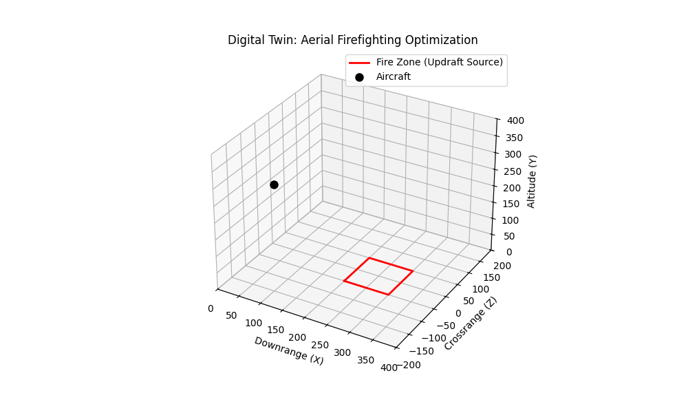
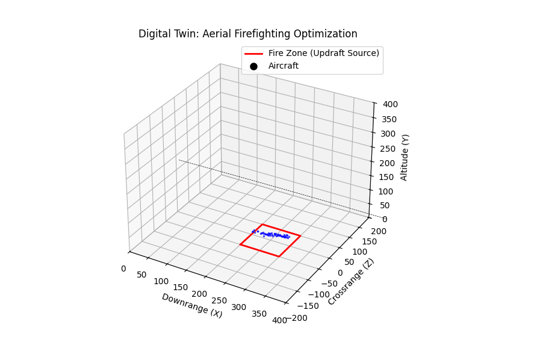
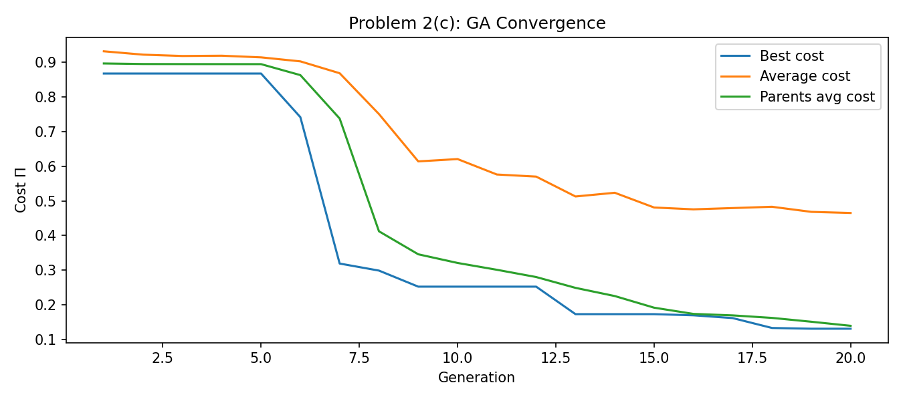
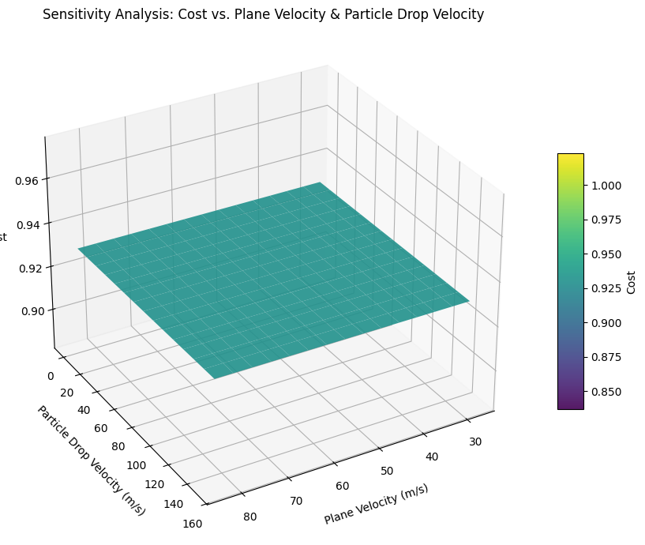
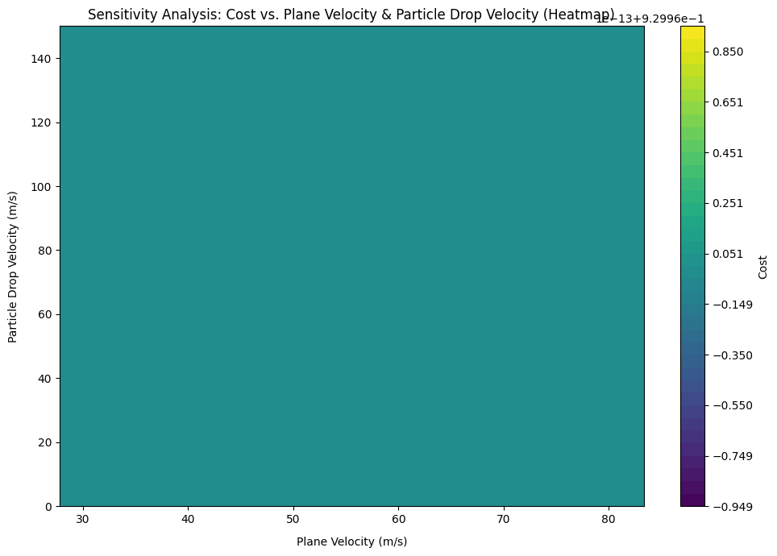
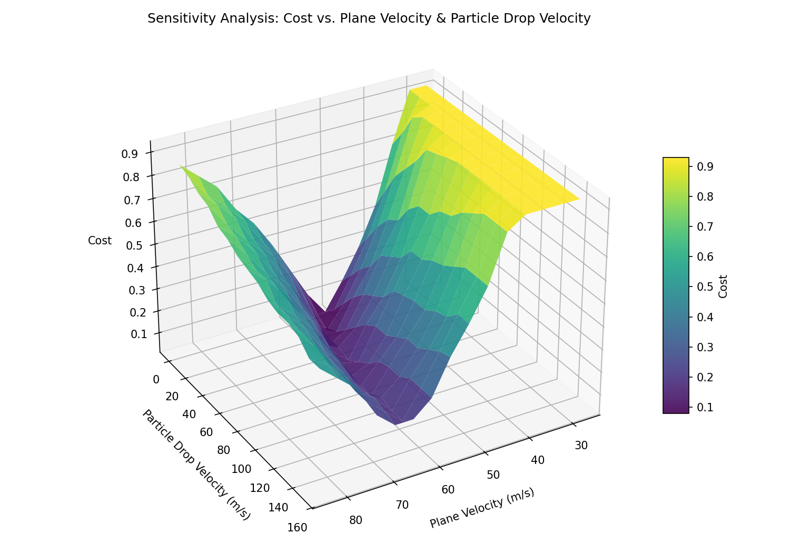
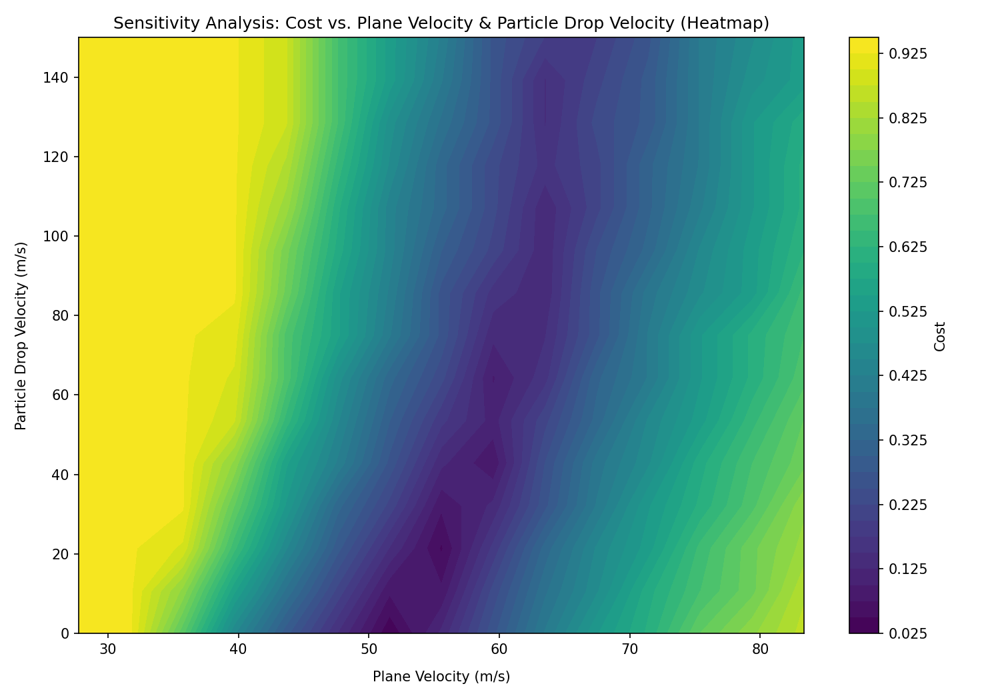

# ME 144/244 — Project 7: Aerial Firefighting

**Course:** Modeling, Simulation, and Digital Twins of Drone-Based Systems  
**University:** University of California, Berkeley · Spring 2026  
**Author:** Aaditya Shrivastava

---

## Optimized Drop — Live Simulation

> Aircraft (black dot) flies a sine-wave path and releases retardant droplets (blue) that fall into the fire zone (red rectangle).



---

## Final Frame — Retardant Coverage



> **~88.7% of tracked droplets land inside the fire zone.** Optimal cost Π(Λ\*) = **0.1310**.

---

## Project Overview

This project simulates a fixed-wing aircraft dropping fire retardant over a wildfire target zone and uses a **Genetic Algorithm (GA)** to optimize a 12-parameter drop configuration for maximum retardant coverage.

The simulation couples aircraft path kinematics with Lagrangian particle dynamics. Each retardant droplet obeys Newton's second law under aerodynamic drag, gravity, and a fire-induced thermal updraft. The optimization minimizes a cost function that simultaneously maximizes fire coverage and pilot altitude safety.

---

## Physics

**Aircraft trajectory** — parametric sine-wave path:

$$\mathbf{r}(u) = (u + x_0,\ y_0,\ A\sin(2\pi u/\lambda) + z_0)^T$$

advanced each timestep by $\Delta u = V\Delta t / \|\mathbf{r}'(u)\|$ to enforce constant airspeed.

**Droplet dynamics** — Newton's second law with drag and updraft:

$$m\ddot{\mathbf{r}} = \mathbf{f}_\text{drag} + m\mathbf{g}, \qquad \mathbf{f}_\text{drag} = \tfrac{1}{2}\rho_\text{air}C_D(\pi r_p^2)\|\mathbf{v}_\text{rel}\|\mathbf{v}_\text{rel}$$

Integrated via semi-implicit Euler. The Chow piecewise $C_D$ model handles Reynolds-number-dependent drag.

**Cost function:**

$$\Pi = W_1\!\left(1 - \frac{N_\text{hit}}{N_\text{total}}\right) + W_2\!\left(1 - \frac{y_0}{y_\text{max}}\right)$$

---

## GA Convergence



All three metrics begin near 0.87–0.93 (random initial population). A sharp improvement occurs around generation 7–8 as the GA discovers a productive region of design space. By generation 20 the best cost converges to **0.1310**.

---

## Sensitivity Analysis

Sweeping plane velocity (V) and ejection speed (vₑ) across a 15×15 grid of 225 simulations each.

### Default Baseline LAM — Cost is Insensitive

| 3D Surface | Heatmap |
|:---:|:---:|
|  |  |

Cost stays flat at ~0.90–0.96 regardless of V or vₑ — the baseline configuration is far from the fire zone and no velocity combination can rescue it.

### GA-Optimized LAM — Rich Nonlinear Landscape

| 3D Surface | Heatmap |
|:---:|:---:|
|  |  |

A deep minimum (cost ≈ 0.025) exists near V ≈ 55–65 m/s and vₑ ≈ 0–30 m/s, surrounded by steep ridges and multiple local minima. This multimodal, non-smooth landscape is exactly why a **Genetic Algorithm** is the right optimizer — gradient methods would get stuck in local minima, and the cost surface has discontinuous edges (a droplet either lands in the fire zone or it doesn't) where gradients are undefined.

---

## Optimal Design Vector Λ\*

| Index | Symbol | Value | Unit |
|-------|--------|-------|------|
| 0 | V | 63.18 | m/s |
| 1 | x₀ | 0 | m (fixed) |
| 2 | y₀ | 177.23 | m |
| 3 | z₀ | 11.88 | m |
| 4 | rₚ | 0.00354 | m |
| 5 | Aₛ | 0.096 | — |
| 6 | t_start | 0.031 | fraction of T |
| 7 | t_end | 0.681 | fraction of T |
| 8 | Q̇ | 8.65 | m³/s |
| 9 | vₑ | 91.12 | m/s |
| 10 | Aᶜ | 4.88 | m |
| 11 | λᶜ | 1558.0 | m |

**Π(Λ\*) = 0.1310**

---

## Repository Structure

```
├── Code/
│   ├── src/
│   │   ├── simulation.py               ← Completed physics simulation (main deliverable)
│   │   ├── student_simulation.py       ← Original template with blanks
│   │   ├── geneticalgorithm.py         ← GA subclass: generates & evaluates designs
│   │   ├── ga_class.py                 ← Base GA: selection, crossover, immigration
│   │   ├── aerial_sensitivity_analysis.py  ← Sensitivity sweep over V and vₑ
│   │   ├── animation.py                ← 3D animation and convergence plots
│   │   ├── write_parameters.py         ← Writes parameters.pkl (run this first)
│   │   └── main.ipynb                  ← Main notebook: runs all problems
│   └── animations/
│       ├── ga_result.gif               ← Optimized drop animation
│       ├── ga_convergence.png          ← GA convergence plot
│       ├── sensitivity_surface_default.png
│       ├── sensitivity_heatmap_default.png
│       ├── sensitivity_surface_ga.png
│       └── sensitivity_heatmap_ga.png
└── Proj 7/
    ├── project7.tex                    ← Full LaTeX report
    ├── preamble.sty                    ← LaTeX style file
    └── ME144_244_S26_Project7.pdf      ← Assignment PDF
```

---

## How to Run

```bash
# 1. Install dependencies
pip install numpy matplotlib jupyter

# 2. Generate parameters file
cd Code/src
python write_parameters.py

# 3. Open and run the notebook
jupyter notebook main.ipynb
```

> `parameters.pkl` and `ga_results.pkl` are excluded from the repo (regenerated by the steps above). The GA takes ~10–20 minutes for 20 generations × 20 designs.

---

## Key Implementation Notes

- **`simulation.py`** fills in all 10 blanks from `student_simulation.py`: aircraft kinematics, 4-nozzle geometry, stochastic spray direction, fire zone detection, exponential updraft, Chow piecewise drag, semi-implicit Euler, and the weighted cost function.
- **Super-particle method:** Each tracked droplet represents 10⁶ physical droplets (`FRACTION_PARTICLES_TRACKED = 1e-6`), keeping particle counts tractable (~30 tracked vs ~2.4 billion physical at rₚ = 1 mm).
- **GA settings:** S = 20 population, P = 6 parents, K = 6 children, 20 generations, tolerance = 0.01.
